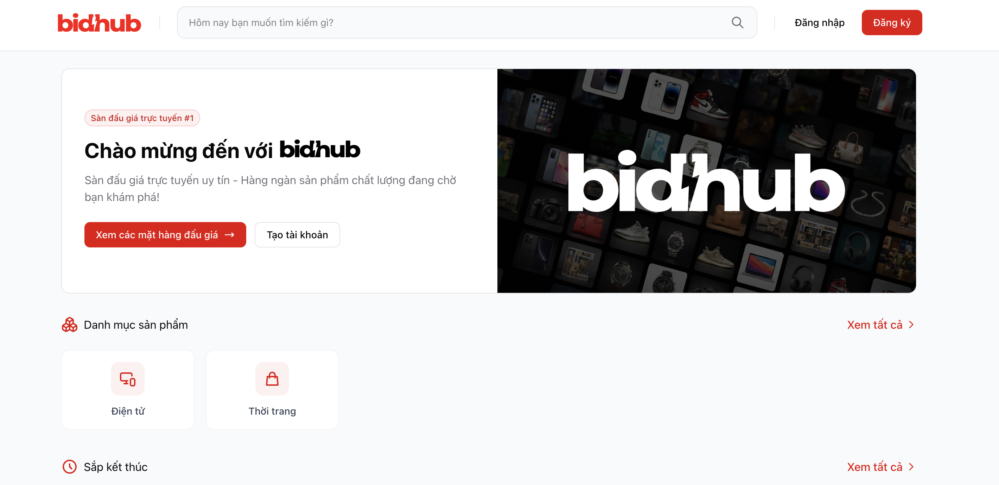

# BIDHUB (Đồ án cuối kì Online Auction - 23KTPM3)



## Tech Stack
- **Backend:** Node.js, Express.js
- **Database:** Supabase (PostgreSQL)
- **Frontend:** Handlebars (SSR), Tailwind CSS
- **Auth:** Passport.js, bcrypt
- **Session:** express-session, connect-session-knex
- **Realtime:** fetch API
- **Other:** Preline UI, Nodemailer, reCAPTCHA v2

## Các file nộp cho đồ án:
[Google Drive - All Files](https://drive.google.com/drive/folders/1igg3-4h5gjbM_F-bDy0IhOL-smB9UfJT?usp=drive_link)

## Hướng dẫn cài đặt & chạy web

### 1. Clone repo
```bash
git clone https://github.com/thlam05/online-auction.git
cd online-auction
```

### 2. Cài đặt thư viện
```bash
npm install
```

### 3. Tạo file môi trường
Tải file `.env` tại [Google Drive - .env](https://drive.google.com/file/d/1_eRKuV_ixaFfxtVN0L-s7NM8vfM3OdCX/view?usp=sharing)

### 4. Chạy web
```bash
npm run dev
```
Truy cập: [http://localhost:3000](http://localhost:3000)

---

## Dump account để test:
```
1. Admin:
Email: admin@bidhub
Password: 123

2. Seller:
Email: seller@bidhub
Password: 123

3. Bidder:
Email: test@bidhub
Password: 123
```

## Thông tin thành viên nhóm

- **Đào Hoàng Đức Mạnh**
  - MSSV: 23127417
  - Email: dhdmanh23@clc.fitus.edu.vn

- **Trương Hoàng Lâm**
  - MSSV: 23127402
  - Email: thlam23@clc.fitus.edu.vn 
